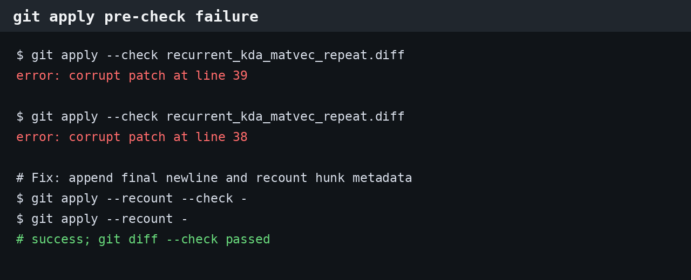

# RecurrentKDA DataCopy repeat 开发问题记录

## 1. 结论

本轮完成 `op_kernel/arch35/recurrent_kda.h` 全部 `DataCopy` 审计、generic `MatVecMul` repeat 候选验证和 K=128 热路径 dual load/store 验证。

- README 方式 A 的 ascend950 wheel 构建通过；
- 最终交付版本没有编译失败或算子运行时失败；
- 四项精度门禁和 ATK performance 均通过；
- 开发过程中发生 1 个补丁应用问题，源码在失败阶段未被修改，详见下文。

## 2. 问题：unified diff hunk 元数据错误

### 2.1 报错

在将 `MatVecMul` 改为 LocalTensor repeat 候选时，首次执行补丁预检报错：

```text
error: corrupt patch at line 39
```

修正一次行数后，由于补丁末尾换行与 hunk 计数仍不一致，又出现：

```text
error: corrupt patch at line 38
```

报错截图：



### 2.2 根因

补丁正文增删行数与 `@@ -old,count +new,count @@` 中的 count 不一致，且 PowerShell here-string 首次编码后没有显式补终止换行。`git apply --check` 在解析阶段即拒绝补丁，因此目标源码未发生部分修改。

### 2.3 解决办法

1. 重新按函数完整范围核对 old/new 行数；
2. 编码前显式追加终止换行；
3. 使用 `git apply --recount --check -` 先根据正文重算 hunk 行数并预检；
4. 预检通过后再使用 `git apply --recount -` 应用；
5. 随后执行 `git diff --check` 和定向 diff 审计。

修复后补丁成功应用，且方式 A 完整构建通过。

## 3. 编译问题记录

最终保留版本与 `MatVecMul` repeat 候选均通过 README 方式 A 的完整 ascend950 wheel 构建，未发生 CCE 编译错误、寄存器 spill 报错或不支持的 DataCopy dist 报错。

因此本轮没有编译失败截图；不为满足形式要求伪造不存在的编译错误。

## 4. 运行时问题记录

最终保留版本未发生算子运行时错误：

- ATK accuracy：8/8 PASS；
- PTA：全部正向场景和预期 host 拦截场景通过；
- torch_custom：5 组场景通过；
- operator pytest：27 passed；
- ATK performance：两轮均为 8/8 SUCCESS。

运行日志中出现过平台的 32-byte padding 提示及 ATK/Pydantic 序列化 warning；二者未改变返回码、精度或 profiler 结果，不属于本次算子失败。

## 5. MatVecMul repeat 候选为何未保留

候选使用 LocalTensor `Mul(..., repeatTime, BinaryRepeatParams)` 去掉逐行 RegTensor load/store。该候选能够通过完整编译，但当前接口只允许 `K=128`，`Compute` 固定进入 K=128 融合路径，不执行 generic `MatVecMul`。

加入候选后的三轮 ATK 总耗时均值为 `986.8152 us`，相对本任务开工前基线只改善 `0.72%`，且长 case 7 出现连续退化；无法把收益归因到不可达的 `MatVecMul`。按设计停止条件回退该候选，保留实测更优的 K=128 dual DataCopy 版本。
