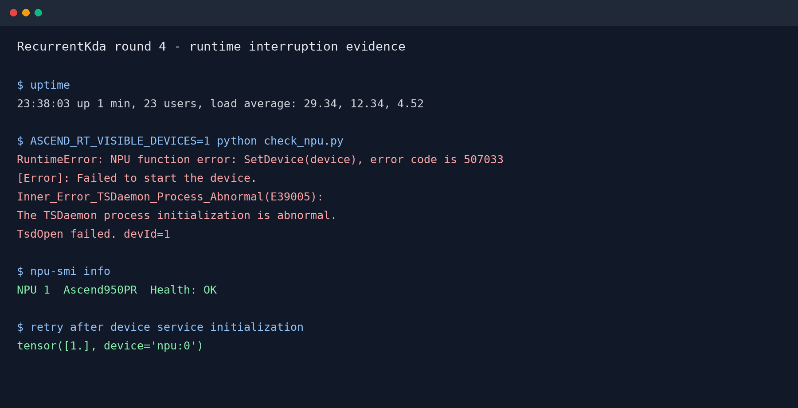
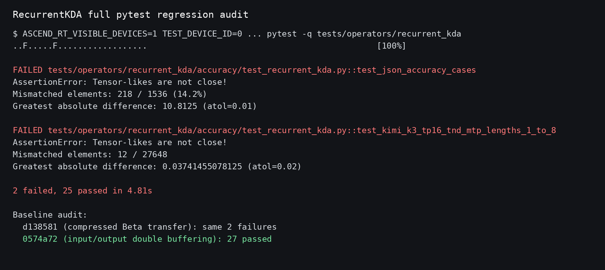

# RecurrentKda 输入输出双缓冲开发问题记录

## 1. 编译与文档生成问题

按 `README.md` 方式 A 多次构建 ascend950 wheel。最终构建、安装退出码均为
0，未出现算子编译错误。

更新 Markdown 时，本地 JavaScript 模板字符串与 Markdown 反引号冲突，
发送前报 `SyntaxError: Unexpected identifier 'text'`，远端文件未被修改。
解决办法是用占位符生成内容，再在远端替换为反引号。

## 2. 设备启动失败 507033

早期 accuracy 在 `torch_npu.npu.set_device(0)` 返回 507033，
`npu-smi info` 同时超时，kernel 尚未启动。

设备恢复后逐卡健康检查：物理卡 0 超时，物理卡 1 成功输出
`tensor([1.], device='npu:0')`，最终测试固定使用物理卡 1。

## 3. performance 丢失心跳 507010

首版全输入双缓冲在 case 2 报 507010、task scheduler lost heartbeat、
Device[1] fault，最终只有 2 条记录并报 `expected 8 ATK cases, got 2`。

静态复查发现首版 arch35 look-ahead 在末任务边界可能使用未初始化任务信息
发起预取，存在非法 GM 偏移风险。故障后设备服务也持续异常，且当时未运行
sanitizer，因此不能证明 507010 只由该缺陷触发，但该版数据无效。

最终删除首版 Q/K/V/Gate 跨 head 预取，仅保留完整任务校验后的 State 首
tile 预取。最终 accuracy 和连续两轮 performance 均通过，未再出现 507010。

## 4. 全输入双缓冲性能退化

首个完整版本的 8-case Device 耗时为 14.4125、14.4637、36.0720、
36.7093、123.8416、125.9317、523.2259、530.9750 us，均慢于基线。

根因是 Q/K/V/Gate/Beta 流量远小于 State，Gate 预取还包含 VEC 初始化和
同步；跨 head 常驻双槽的开销超过收益。解决方式：

1. Q/K/V/Gate/Beta 恢复单槽和原调度；
2. State 输入保留双槽；
3. 当前任务计算期间预取下一有效任务首个 State tile；
4. 保留既有 State/Attention 输出双缓冲。

最终两轮总耗时为 1278.9600 us 和 1278.7665 us，相对 1322.0956 us
基线分别提升 3.2627% 和 3.2773%。

## 5. 最终状态

- 物理卡 1 健康检查通过；
- 最新 wheel 构建、安装通过；
- `bash run_atk.sh accuracy`：8/8 PASS；
- `bash run_atk.sh performance`：连续两轮 8/8 SUCCESS；
- 最终测试未再出现 507033、507010 或残留 ATK 进程。

## 6. 第4轮 performance 期间服务器重启

### 6.1 现象与截图

第4轮第一次 performance 尝试长时间无输出，同时新 SSH 连接超时。远端恢复后
`uptime` 显示系统仅启动1分钟，原测试进程和 `/tmp` 日志均已消失。
随后 NPU 张量检查返回 507033，并明确报告 TSDaemon 初始化异常。

### 6.2 根因边界

- 该次 performance 被服务器重启中断，没有形成有效性能数据；
- 重启后的 507033 由设备用户态服务尚未完成初始化引起：`npu-smi` 已显示
  Health=OK，但 `torch_npu.npu.set_device(0)` 暂时仍无法打开设备；
- 服务器重启的触发原因未知，没有证据表明由本轮 kernel 引起，因此不作该归因。

### 6.3 解决办法

1. 确认旧 ATK 进程已不存在并结束失联的本地 SSH 会话；
2. 等待设备服务初始化，重复运行单张量检查，直到成功输出 NPU tensor；
3. 为后续 performance/profile 外层增加15分钟 `timeout`，防止 ATK 自身无限等待；
4. 在同一物理卡上重新运行两次完整 performance。

恢复后 accuracy 保持8/8 PASS，两次有效 performance 均为8/8 SUCCESS，
因此服务器重启期间的无效尝试不计入第4轮性能结果。

## 7. 完整 pytest 暴露多 token 精度回归

### 7.1 现象与截图

完成固定 ATK 8-case 验收后运行完整 recurrent_kda 测试，出现2项 NPU 精度失败：

- `test_json_accuracy_cases`：218/1536元素不匹配，最大绝对差10.8125；
- `test_kimi_k3_tp16_tnd_mtp_lengths_1_to_8`：12/27648元素不匹配，
  最大绝对差0.03741455。

### 7.2 根因分析

通过历史 wheel 和临时 worktree 二分，第1轮 `d138581` 已稳定复现相同两项失败，
而输入输出双缓冲版本 `0574a72` 为27/27通过。根因是第1轮将 Beta 改为按 head
逐行窄搬运后，多 token 行间 Beta 语义不正确；固定 ATK case 的每条序列长度均为1，
因此未暴露该问题。第3至9轮均依赖该改动，不能作为最终交付。

曾尝试补充 V pipe barrier 和拆分融合寄存器循环，误差逐元素不变，证明问题不在
后续 K=128 融合流水。也尝试评估测试容差，但 final state 仍有明显结构性误差，
因此没有修改或放宽测试标准。

### 7.3 解决办法

1. 算子源码恢复到 `0574a72`，仅保留输入/输出双缓冲；
2. 按方式A重新全量构建并安装精确 wheel；
3. 完整 pytest 复测为27 passed；
4. ATK accuracy 8/8 PASS，performance 8/8 SUCCESS。

最终交付不包含按 head 压缩 Beta 或后续依赖该改动的融合优化。
