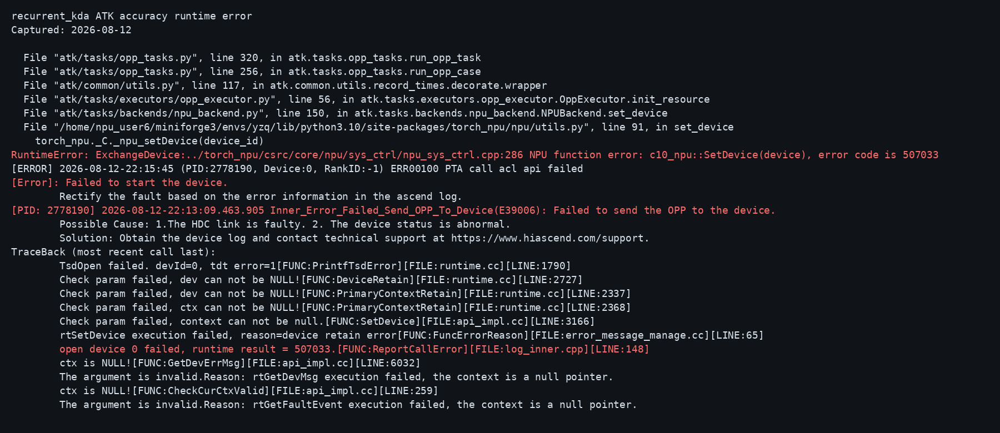
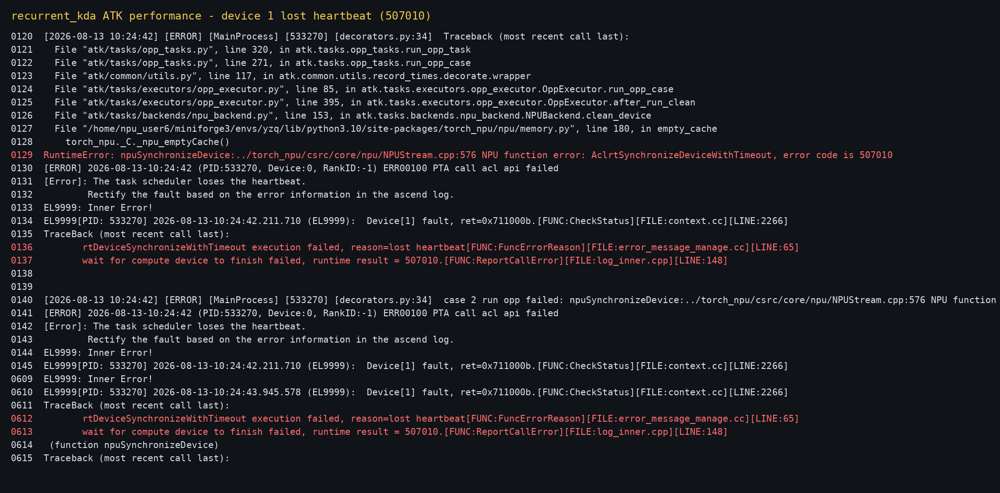

# RecurrentKda 输入输出双缓冲开发问题记录

## 1. 编译与文档生成问题

按 `README.md` 方式 A 多次构建 ascend950 wheel。最终构建、安装退出码均为
0，未出现算子编译错误。

更新 Markdown 时，本地 JavaScript 模板字符串与 Markdown 反引号冲突，
发送前报 `SyntaxError: Unexpected identifier 'text'`，远端文件未被修改。
解决办法是用占位符生成内容，再在远端替换为反引号。

## 2. 设备启动失败 507033

早期 accuracy 在 `torch_npu.npu.set_device(0)` 返回 507033，
`npu-smi info` 同时超时，kernel 尚未启动。

设备恢复后逐卡健康检查：物理卡 0 超时，物理卡 1 成功输出
`tensor([1.], device='npu:0')`，最终测试固定使用物理卡 1。

## 3. performance 丢失心跳 507010

首版全输入双缓冲在 case 2 报 507010、task scheduler lost heartbeat、
Device[1] fault，最终只有 2 条记录并报 `expected 8 ATK cases, got 2`。

静态复查发现首版 arch35 look-ahead 在末任务边界可能使用未初始化任务信息
发起预取，存在非法 GM 偏移风险。故障后设备服务也持续异常，且当时未运行
sanitizer，因此不能证明 507010 只由该缺陷触发，但该版数据无效。

最终删除首版 Q/K/V/Gate 跨 head 预取，仅保留完整任务校验后的 State 首
tile 预取。最终 accuracy 和连续两轮 performance 均通过，未再出现 507010。

## 4. 全输入双缓冲性能退化

首个完整版本的 8-case Device 耗时为 14.4125、14.4637、36.0720、
36.7093、123.8416、125.9317、523.2259、530.9750 us，均慢于基线。

根因是 Q/K/V/Gate/Beta 流量远小于 State，Gate 预取还包含 VEC 初始化和
同步；跨 head 常驻双槽的开销超过收益。解决方式：

1. Q/K/V/Gate/Beta 恢复单槽和原调度；
2. State 输入保留双槽；
3. 当前任务计算期间预取下一有效任务首个 State tile；
4. 保留既有 State/Attention 输出双缓冲。

最终两轮总耗时为 1278.9600 us 和 1278.7665 us，相对 1322.0956 us
基线分别提升 3.2627% 和 3.2773%。

## 5. 最终状态

- 物理卡 1 健康检查通过；
- 最新 wheel 构建、安装通过；
- `bash run_atk.sh accuracy`：8/8 PASS；
- `bash run_atk.sh performance`：连续两轮 8/8 SUCCESS；
- 最终测试未再出现 507033、507010 或残留 ATK 进程。
